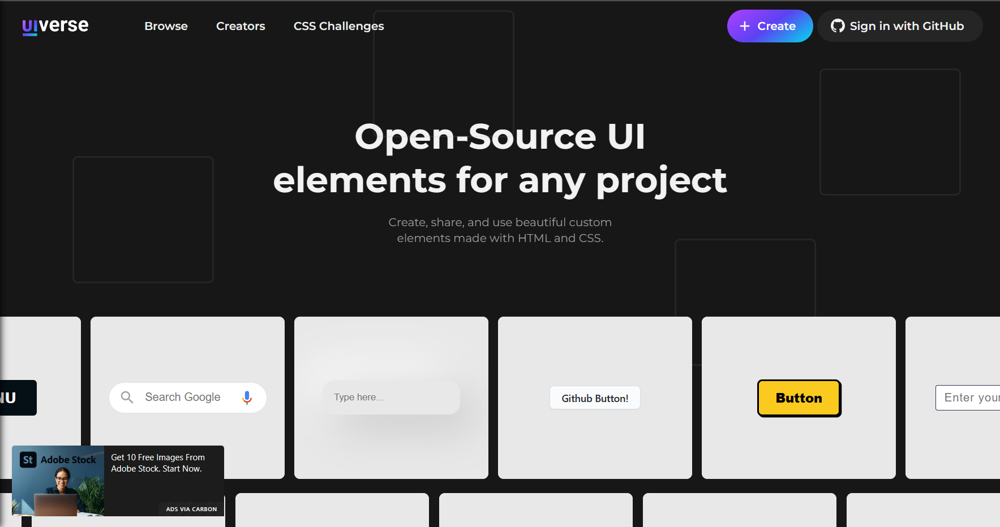

# All in One

### [Open-Source UI elements for any project](https://uiverse.io/)

> 

### [replit](https://replit.com/)

> 

### [Css Generator](https://www.html-code-generator.com/css/)
> 

### [All online tools in one box](https://10015.io)
> 

# Shapes

### [Blob Maker](https://www.blobmaker.app)
> 

### [Soft UI CSS code](https://neumorphism.io/)
> 

### [Fancy Border Radius](https://9elements.github.io/fancy-border-radius/#46.30.30.30--.)
> 

### [Backgroud](https://hype4.academy/tools/glassmorphism-generator)
> 

